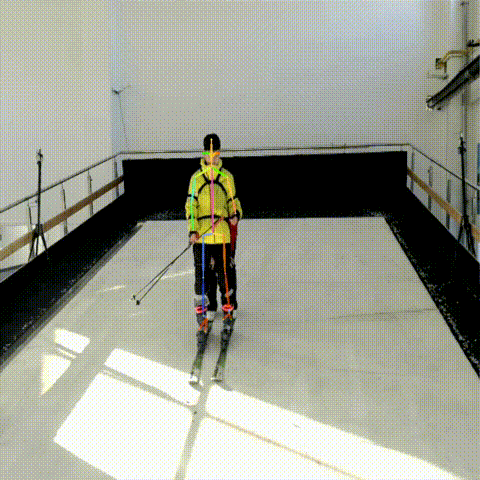
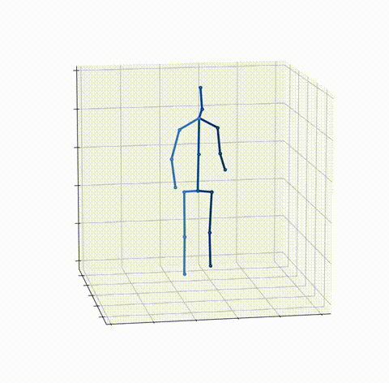

### 🎥 Example (GIFs)

  
  
  

## Acknowledgement
This project has benefited from the following work, and we sincerely thank all contributors: 
- [AlphaPose](https://github.com/MVIG-SJTU/AlphaPose). 
- [MotionBERT](https://github.com/Walter0807/MotionBERT). 

We gratefully appreciate their open source contribution!
