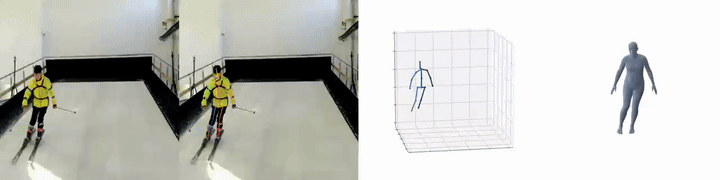
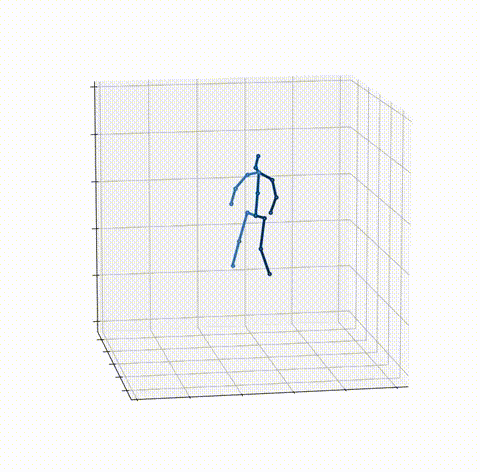

### 🎥 Example (GIFs)

<p align="center">
  
</p>

<!-- <p align="center">
  
  
  
</p> -->

# Dataset Description

This dataset is a motion capture record of a skier's dynamic movements, collected using an Inertial Measurement Unit (IMU).  
Each sample is time-sequenced and associated with a specific timestamp `t` (in seconds).

For every timestamp, the dataset contains **10–20 anatomical keypoints**, representing major joints or body segments, such as:

- Ankles  
- Knees  
- Shoulders  
- Wrists  

---

## Data Format

For each **keypoint** at a given timestamp, two components are provided:

1. **3D Position Coordinates**  
   - A triplet `(x, y, z)`  
   - Units: meters  
   - Represents the spatial position of the keypoint in 3D space.

2. **Orientation Quaternion**  
   - A normalized 4D vector `(q_w, q_x, q_y, q_z)`  
   - Encodes the rotational pose of the keypoint.  
   - Quaternions are used to:
     - Avoid gimbal lock  
     - Enable smooth and robust orientation interpolation  
   - Normalization condition:
     \[
     q_w^2 + q_x^2 + q_y^2 + q_z^2 \approx 1
     \]

---

## Hierarchical Structure

The data is organized per timestamp. Conceptually, each time step `t` looks like this:

```text
t |
  (x1, y1, z1), (q_w1, q_x1, q_y1, q_z1) |
  (x2, y2, z2), (q_w2, q_x2, q_y2, q_z2) |
  ...
```

- `t` – timestamp in seconds  
- Each `|` separates **individual keypoints** at the same timestamp  
- Each time step (i.e., each `t` block) forms one sequential data unit in the time series

---

## Intended Use Cases

This dataset is designed for research and development in:

- **Motion analysis**  
- **Pose estimation**  
- **Biomechanics and joint kinematics**  
- **Human activity recognition**  
- **Injury prevention systems**  
- **Sports performance analysis and optimization**

The combination of **3D position** and **orientation** for each keypoint enables:

- Detailed analysis of whole-body motion patterns  
- Evaluation of algorithms in **dynamic, real-world skiing scenarios**  
- Training and validation of machine learning models that require both positional and rotational information

## Acknowledgement
This project has benefited from the following work, and we sincerely thank all contributors: 
- [AlphaPose](https://github.com/MVIG-SJTU/AlphaPose). 
- [MotionBERT](https://github.com/Walter0807/MotionBERT). 

We gratefully appreciate their open source contribution!
